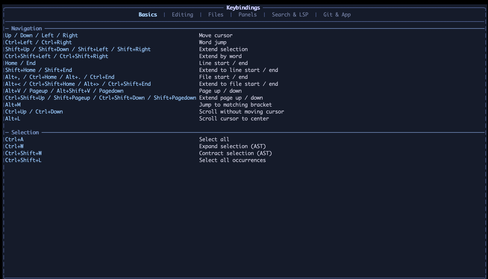
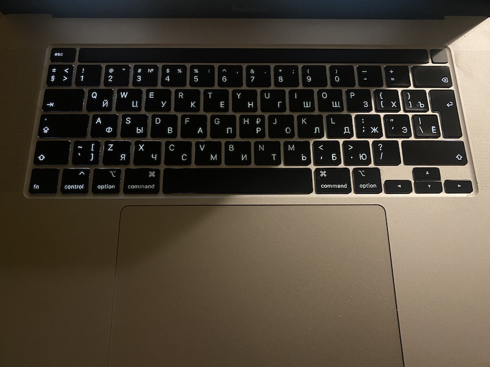

Recently I wanted to try newly vibecoded [.txt editor](https://github.com/ErikHellman/txt). Newly I mean, is that I want to find an app to replace `nano`, so something that was written after 2010. So I installed, opened it, and this was help screen (`F1` key).

Notice the problem?

This is my keyboard

I bet, >80% of users who is not mobile now has kind of same keyboard. It's a laptop keyboard. It's missing `Home`, `PageUp`, `PageDown`, `NumLock`. Yet terminal people still consider everyone lives with fullblown keyboard, Logitech mouse and a pair of Genius speakers. C'mon. And this is the problem with `TUI` I have in general. No matter how people try, 80's are calling back.

When you're building `TUI`, imagine not him:

Imagine him:

Back to `nano`. Unfortunately keybindings in `TUI` are broken beyond repair.